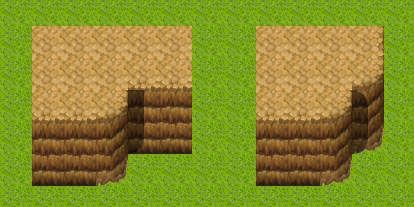
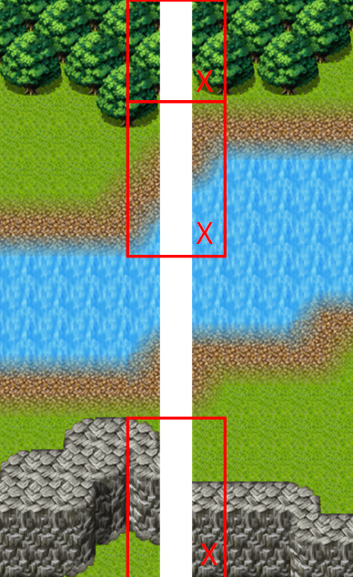
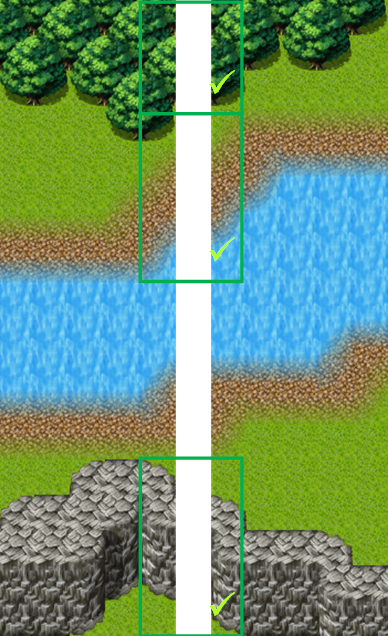
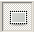

# Mapmaking Guidelines

See the [Map Editor](map-editor.md) to get some information about the layers used for Andor's Trail.

Also, see the Mapmaking tutorial for a guide with screenshots on how to make maps for Andor's Trail: [Map Making](map-making/)

We will still need several maps with:

* Any kind of outdoor maps with mountains, villages and towns, lakes, forests, roads etc.
* Indoor maps for small houses, like the Fallhaven houses
* Dungeons

What map will you make, a deadly forest inhabited by bloodthirsty wolves or a damp dungeon filled with friendly necromancers? You decide.

## Quick version

If you quickly want to start making maps, do the following steps:

1. Download the Tiled map editor.
2. Download the latest [sourcecode](https://github.com/Zukero/andors-trail) for Andor's Trail.
3. Examine an existing map.
4. Open the “template.tmx” map. Save that as a new file.
5. Post your map in the ([Andor's Trail forums](https://andorstrail.com)) or email the map to the project team (andor@andorstrail.com).

## Map Rules

All maps must follow these rules:

1. All maps in Andor's Trail must use the same tileset files (the smaller split up png files). We can of course add new things to the tileset if we find something that fits with the existing world.
2. All maps in Andor's Trail must have the same medieval look and feel.
3. Maps in Andor's Trail have generally a maximum of 30×30 tiles. While it might be technically feasible to import larger maps than that, there is currently no real benefit to make them larger than that compared to several smaller maps.
4. The tiles used from the tileset (.png files) need to make the map look as realistic as the existing maps. This means that there should be no straight edges for example when changing from grass to mountain. The tilesets allow smooth transitions for most ground types. The existing maps do not have any sharp edges since that makes the maps look unreal.
5. All maps must use the same standard on layer names. See the “template.tmx” file or the map edit wiki page on what layers are available.
6. Each house floor, entrance and mountain wall is generally two tiles high.
7. Since we generally only display 10×10 tiles of the maps at one time in the game, we cannot have large areas of 10×10 tiles that are empty, since that would make the game look very uninteresting and odd.
8. The world should contain shadows on the right side of things that may cast a shadow. This is usually added to the “Above” layer so that the player will get partly shadowed for example when standing right next to an indoor wall.
9. Indoor maps should have walls in all directions except the southernmost map border.&#x20;
10. Outdoor maps should somehow indicate to the player where there are tiles that will lead to other maps. For example, a road that leads into the map edge.&#x20;
11. Map edges should fit with the map edges on the map they lead to. For example, if there are two trees north of the west map exit, there should be two trees north of the east map exit on the map that it leads to.&#x20;
12. Try to not make the maps look too “cute”. The Andor's Trail world is a tough place. No excess in amount of flowers. A stone or some dead grass fits better than a bunch of flowers.

There is a simple rule for placing the tops of the shadows:

* If the wall behind the shadow is straight, the shadow's top is straight as well.
* If the wall behind the shadow is an edge, the shadow's top is round.

## Alignment Rules

&#x20;Always align your maps to each other to make them fit in the worldmap of Andor's Trail! Try to make the outdoor maps of the **same size (30×30 tiles)** to make them align more easily!The most common misalignments are trees, edges and walls. The following pictures show the most common misalignments:

To check whether your maps are aligned, follow these steps to create a worldmap:

1. Open Tiled (Click this [**link**](https://andorstrail.com/wiki/test/andors_trail_wiki/developer_section/map_making.html) if you haven't already installed the program.)
2. Load all your maps in Tiled which you want to place in a world map.
3. Import the template.tmx file and save it as a new file.
4. Enlarge the size of the former template.
5. Head over to one of your maps which you want to place in the world map.
6. Click the “Rectangular Select” button  that can be found in the menu at the right of the “Eraser” button.
7. Select the “Ground” layer of your map.
8. Drag your mouse from the top left corner to the bottom right corner (Zoom out if required).
9. Copy the layer by using Control+C.
10. Paste the layer in the world map at an appropriate place (Press Control+V).
11. Keep repeating that procedure for every layer of your map until you have copied the whole map. (Only the layers “Ground”, “Objects” and “Above” are essential).
12. Upon pasting your next map, leave one tile of space between the you map you have pasted before. The tile of space isn’t counted as real tile in the worldmap, it just shows the mapchange areas between the maps.
13. If you want to move the maps in your world map, head to Map/Offset Map.
14. You can create an image of the world map by clicking File/Save As Image. WARNING: Images rendered at a high zoom level will be extraordinarily large!
15. Check for misalignments and correct them.
16. Now, your map is ready to present to the development team of Andor's Trail!
