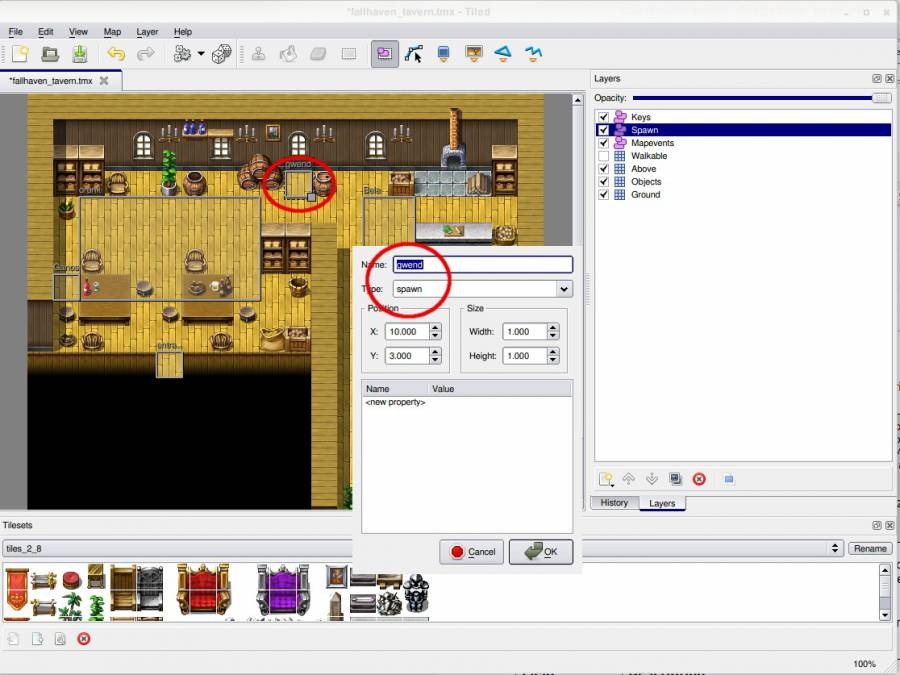
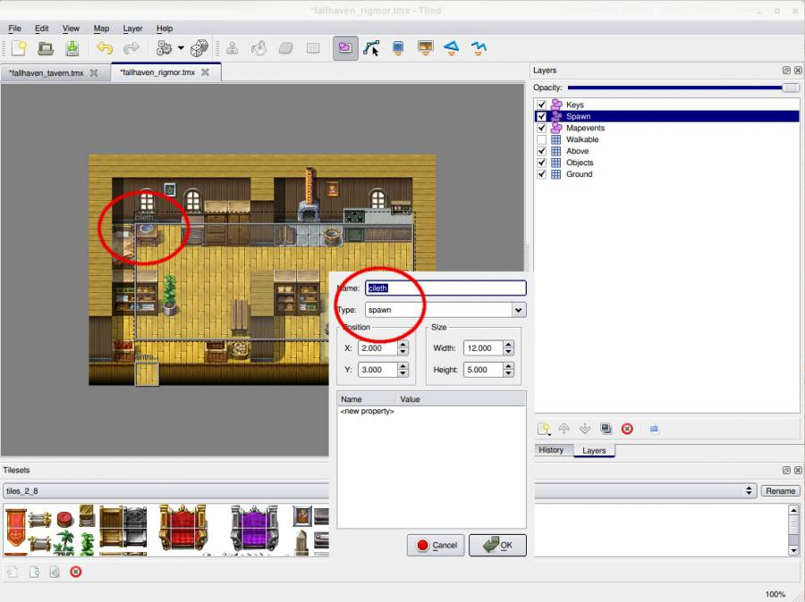

# Creating and Placing NPC's

## Creating NPC's

The example quest in this tutorial will require three unique NPCs that progress the quest. There is the NPC that will provide the rumor about Cileth having lost something, there is Cileth herself and there is the goblin boss monster Olgnuur.

Each of these NPCs can be created in [ATCS](../../contributor-section/atcs/).

| Field                  | Description                                                                                                                                                                                                                                                                                                                                                                                                         |
| ---------------------- | ------------------------------------------------------------------------------------------------------------------------------------------------------------------------------------------------------------------------------------------------------------------------------------------------------------------------------------------------------------------------------------------------------------------- |
| Internal ID            | Can be just about anything, just make it uniquely define the monster. Will not be visible to the player. Prefer short values in lower-case. Use \_ instead of spaces.                                                                                                                                                                                                                                               |
| Spawngroup             | This value will be used on the map where the monster or NPC is spawned, to define what types of monsters the spawn area should contain. For example, if several monsters specify their spawngroup as “goblin1”, and the map contains an area that spawns group “goblin1”, the game will randomly select one monster type from that group to spawn there. For NPCs, this value should be equal to their internal id. |
| Faction                | Advanced feature for quests that causes monsters to become hostile without interacting with them. Just leave it empty for now.                                                                                                                                                                                                                                                                                      |
| Conversation Phrase ID | The id of the starting Phrase that will be shown when the player engages in dialogue with the NPC. See “Dialogue” below for more info on what a Phrase is defined as. For NPCs, prefer to name the starting phrase to the same as the NPC’s internal id.                                                                                                                                                            |
| Droplist ID            | The id of the list of things that will be dropped when the player kills the monster or NPC. See “Quest items” below for more info.                                                                                                                                                                                                                                                                                  |

Also note that Olgnuur has a droplist, but Cileth does not. This is again because Cileth will not be available for combat—only Olgnuur will.

## Placing NPC's

The maps in Andor’s Trail are created by using [Tiled](../mapmaking-guidelines/map-editor.md) as a map editor.

To place these three NPCs on maps, we open the map files using Tiled and create object areas of type “spawn” where they should be placed:

Notice that the names of the spawn areas on the maps correspond to the values in the “spawngroup” field of the monsters that should be spawned there.
