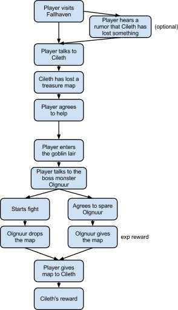

# Define the Structure

## General Idea

In order to come up with an idea for a quest, there are a lot of good resources:

* The community forums
* [Design guideline document](https://docs.google.com/document/d/1BwWD1tLgPcmA2bwudrVnOc6f2dkPLFCjWdn7tXlIp5g/edit)
* Name generators:

[http://www.squid.org/rpg-random-generator](http://www.squid.org/rpg-random-generator)\
[http://dicelog.com/yafnagen](http://dicelog.com/yafnagen)\
[http://donjon.bin.sh/name/](http://donjon.bin.sh/name/)

For this tutorial, we will assume that we want to create a quest called “You remind me of the babe, what babe?“, where the player is requested to retrieve a lost treasure map from a goblin cave. The quest will be given by an NPC named Cileth in Fallhaven (this quest is not actually present in Andor’s Trail). The player will be given a choice of whether to spare the goblin boss monster or not.

## Flowchart

A flowchart is an excellent tool to use to help concretize the structure of the quest. It is of course not always needed, but can sometimes help a lot when planning the high-level structure of a quest, in order to not get stuck on the details too quick.

For the existing quests in Andor’s Trail, various tools have been used to create flowcharts for quests, but the tool that (at the moment) wins in ease-of-use is to create a drawing in Google Docs.

For the example quest in this tutorial, a flowchart could look something like this:

## The Quest Log

In the game, the text you see on the character screen, in the “Quests” tab, is called the quest log. Each quest is composed of several stages, where each stage has an assigned internal integer value. As the player progresses in a quest, their progress will be represented by which of these stages that the player has reached.

Looking at the flowchart for the quest, each box will be represented by roughly one quest stage.

As you may have noticed, the quest log is always written in the first tense, as if the player wrote the text. For example, “I saw a ..” compared to “The player saw a ..”.

Our quest with Cileth might have these quest stages:

| Stage | Description                                                                                                                                                                                               |
| ----- | --------------------------------------------------------------------------------------------------------------------------------------------------------------------------------------------------------- |
| 10    | I heard a rumor in Fallhaven about someone named Cileth that lost something very valuable.                                                                                                                |
| 20    | I talked to Cileth in Fallhaven. She told me about a treasure map that she used to have, but that s he lost it a few days ago, while travelling in the wilderness.                                        |
| 30    | I have agreed to help Cileth find the treasure map.                                                                                                                                                       |
| 40    | Cileth believes that she might have lost the map near a cave that was filled with goblins, outside the village. She has given me directions to the cave. I should go there and search for the map inside. |
| 50    | Inside the goblin cave, I encountered a goblin named Olgnuur. Olgnuur told me that the goblins just want to be left alone by all the pesky humans. If I leave him alone he will give me the map.          |
| 60    | I have agreed to spare Olgnuur’s life.                                                                                                                                                                    |
| 65    | Olgnuur has given me the map.                                                                                                                                                                             |
| 70    | I have started attacking Olgnuur. I should return with the map to Cileth once Olgnuur is dead.                                                                                                            |
| 80    | I have given the map back to Cileth.                                                                                                                                                                      |
| 90    | Cileth rewarded me with some gold for helping her recover the map.                                                                                                                                        |

In this example, notice that the player might choose to reach 60, but never 70, or vice versa.

The stage values can be anything, as long as they are positive numbers. They will be presented in the player’s quest log in order by stage value.&#x20;

The internal id can be anything that uniquely defines this quest, it will not be shown to the player. Notice how stage 65 and 90 also gives some exp rewards when reached. Also notice how stage 90 marks the quest as completed.

### Quest items

This quest will require a quest item, the map that Cileth has lost. It can be created in [ATCS](../../contributor-section/atcs/).

## Droplists

To make Olgnuur drop this particular item when he is killed, we’ll create a droplist in [ATCS](../../contributor-section/atcs/).

Olgnuur will drop a few more items when killed, to provide some loot for the player to collect. Notice how all of them have 100% chance of being dropped, and in particular the map itself - it could break the quest if Olgnuur could be killed but would not always drop the map. Quest items should always have 100% drop chance.
