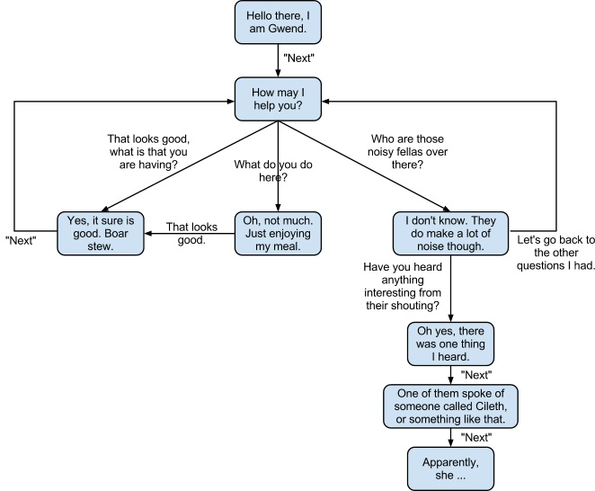
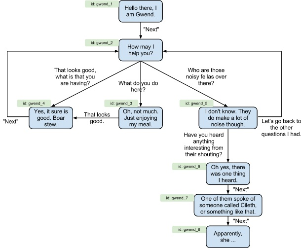
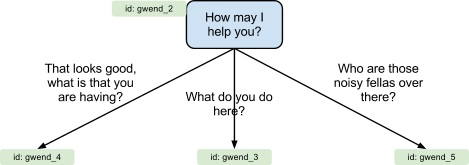
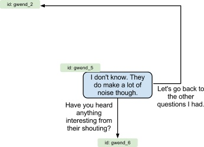
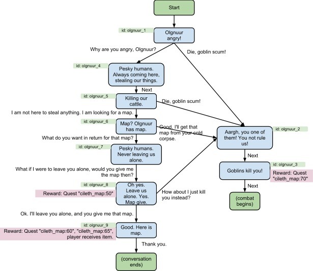
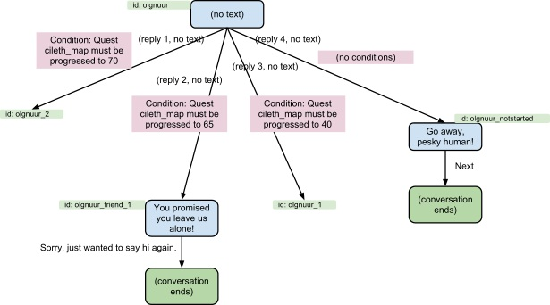

# Dialogue

The conversations are always triggered when the player engages an NPC in conversation or steps on certain tiles. As you noticed in the monster/NPC editor above, all NPCs will have a phrase ID that points to the start of the conversation of that particular monster type.

A conversation can be seen as a large state-chart of phrases that the player visits by selecting different replies. An example of a conversation tree could be like this:

Notice how the conversation flow can return to places where it has already been, and how some conversation choices can lead to more interesting stories. This is all done in Andor’s Trail by what is aptly named phrases and replies.

To create a conversation in Andor’s Trail, you don’t have to draw a flowchart like the one above - this one is only for illustrative purposes in this tutorial.

## Phrases and Replies

Looking at the flowchart above, let’s call each blue box that the NPC speaks a Phrase, and let’s call the text on each arrow a Reply. The basic structure for conversations in Andor’s Trail is that a conversation is made up of a list of these phrases, where each phrase has a list of possible replies. Each reply defines what the following words will be, and each phrase defines what available replies there are.

First, we assign an internal ID to each phrase. It can be just about anything, as long as the ID is unique over the whole game. Prefer to use the NPC’s name to make it unique, and prefer short IDs in lowercase.

Let’s take one phrase from the above flowchart as an example of how just one phrase is represented:

This phrase defines three possible replies, and can be represented in the following format:

| Phrase ID | Text                | Possible Replies                              | Next phrase id |
| --------- | ------------------- | --------------------------------------------- | -------------- |
| gwend\_2  | How may I help you? | That looks good, what is that you are having? | gwend\_4       |
|           |                     | What do you do here?                          | gwend\_3       |
|           |                     | Who are those noisy fellas over there?        | gwend\_5       |

Another phrase might look like this:

Which, in turn will be represented as the following information:

| Phrase ID | Text                                              | Possible Replies                                         | Next Phrase ID |
| --------- | ------------------------------------------------- | -------------------------------------------------------- | -------------- |
| gwend\_5  | I don't know. They do make a lot of noise though. | Have you heard anything interesting from their shouting? | gwend\_6       |
|           |                                                   | Let's go back to the other questions I had.              | gwend\_2       |

By separating the phrases from the replies, the whole conversation can be defined as just a list of words and the replies they have. In fact, all conversations in Andor’s Trail is stored as a huge list of phrases, with info on their corresponding replies, that in turn lead to other phrases.

### Special Phrases and Replies

As explained in the previous chapter, replies will lead to new phrases. In some cases, we want something else to happen when selecting a reply, such as ending the conversation or initiating combat. For these special actions, there are some predefined phrase IDs that the replies can point to:

| Phrase ID | Meaning                                                                                                                                                                          |
| --------- | -------------------------------------------------------------------------------------------------------------------------------------------------------------------------------- |
| X         | Conversation ends.                                                                                                                                                               |
| S         | Conversation ends, and the player will start trading with the NPC that the conversation is with. The NPC will have items to sell available according to the droplist of the NPC. |
| F         | The NPC that the conversation is with will be turned hostile. Combat starts with the player having the first turn.                                                               |
| R         | Conversation ends, and the NPC that the conversation is with will be removed from the current map.                                                                               |

These special phrase IDs are not actually visible in the content editor. Instead, they are added if you select anything other than “NPC phrase in the drop-down list labelled “phrase leads to”.

Also, sometimes we just want to do a chain of phrases, where an NPC can speak several phrases while the player just clicks the “Next” button to advance the conversation. This is done by creating just one reply for a phrase, and using only an upper-case N as reply text (visible in the editor by the checkbox “Phrase leads directly to another phrase without replies”).

| Reply text | Meaning                                                                      |
| ---------- | ---------------------------------------------------------------------------- |
| N          | The player will only need to click 'Next' to continue on to the next phrase. |

## Phrase Rewards

To create an actual quest using these conversations, we would need more things to happen other than just having the NPCs speak. To this end, we introduce the concept of phrases that reward upon being reached. Rewards do not necessarily have to be positive, of course :)

Each phrase has a list of rewards that will all be awarded as soon as the player reaches the phrase.

The possible types of rewards that a phrase can give are currently:

| Type            | Meaning                                                                                                                                                                    |
| --------------- | -------------------------------------------------------------------------------------------------------------------------------------------------------------------------- |
| Quest Progress  | The player advances to a specified stage for some quest.                                                                                                                   |
| Droplist        | The player will be given all items specified by a droplist                                                                                                                 |
| Skill           | The player will be given a level increase to a skill. Can of course also include skills that are otherwise hidden (quest skills)                                           |
| Actor Condition | Either the player can be given one magnitude of a condition (poison/bless/rotworms), or the player can have a condition completely removed.                                |
| Faction Change  | The player's faction score for a certain faction can be changed. If a faction score reaches below zero, all monsters of that faction will be automatically turned hostile. |

The most common type is of course to advance some quest for the player. Each reward will define an id and a value of the reward. The values in id and value mean different things, depending on the type of reward:

| Type            | Meaning of 'id' and 'value'                                                                                                                                                                                                                                                                       |
| --------------- | ------------------------------------------------------------------------------------------------------------------------------------------------------------------------------------------------------------------------------------------------------------------------------------------------- |
| Quest Progress  | id = The quest id that will be advanced. value = The quest stage that the player now has reached.                                                                                                                                                                                                 |
| Droplist        | id = The id of the droplist that contains items that the player will be given. value = unused.                                                                                                                                                                                                    |
| Skill           | id = internal id of the skill that will be awarded. value = unused.                                                                                                                                                                                                                               |
| Actor Condition | id = The internal id of the actor condition that will be added/removed. value = The duration of the condition. If specified as 999, it will be a permanent condition. If specified as -99, the condition will be removed. Unless value is 999 or -99, the condition will be added as magnitude 1. |
| Faction Change  | id = Internal id of the faction whose score should change. value = How much the faction score should change.                                                                                                                                                                                      |

## Reply Conditions

To create a complete quest, we also need some way of restricting the choices that the player can make until some conditions have been reached. For example, the player should, of course, not be able to select the reply “Here is your map” while talking to Cileth until the player actually has the map itself.

For this, we use a concept of conditions that each reply might have. For a reply to be visible to the player, all the conditions must be satisfied. For example, the answer “Here is your map” while talking to Cilethmight have a condition saying that the player both has to have the map in inventory and also must have reached stage 30 of the quest (to ensure that the quest has been started).

Replies can require these types of conditions:

| Condition Type      | Meaning                                                                                                                                                                                                                                     |
| ------------------- | ------------------------------------------------------------------------------------------------------------------------------------------------------------------------------------------------------------------------------------------- |
| Inventory (removed) | The player must have some item in inventory, and the item(s) will be removed from the player’s inventory by selecting the reply.                                                                                                            |
| Inventory (kept)    | The player must have some item in inventory. The item(s) will not be removed from the player’s inventory by selecting the reply.                                                                                                            |
| Worn                | The player must currently be wearing some item in any of the equipment slots. The item will not be removed by selecting the reply.                                                                                                          |
| Quest Progress      | The player must have reached a specific stage in some quest in order to select the reply. Quest stages are typically specified as questname:stage. For example “cileth\_map:30” means stage 30 in the quest with internal id “cileth\_map”. |

It is important to note that a reply will be completely hidden for the player if at least one of the conditions is not satisfied.

## Advanced Special-Cases

The concept of phrases & replies is also used in Andor’s Trail to build complex conditional branching logic. Let’s look at the goblin boss monster Olgnuur’s dialogue as an example:

This is the basic conversation flow for Olgnuur. To make him use this conversation, we would put “olgnuur\_1” as starting phrase in the definition of him as a monster, in the monster editor. However, consider these special cases that may occur:

* The player might press “Leave” at any time during the conversation.
* The player might return to speak with Olgnuur again after receiving the map.
* The player might not have started the quest at all.

In all of these cases, if we were to start a conversation at “olgnuur\_1” every time, the conversation would feel really odd - Olgnuur would seem to have a really bad memory. To fix this, we need a way to start the conversation at different points depending on what the player has done earlier.

This is done in Andor’s Trail by using a phrase that does not have any display text. For phrases without display text, the game will automatically advance the conversation to the first reply whose reply conditions are satisfied. This way, we can reuse the concept of reply conditions discussed in the previous chapters to create a complex quest.

We introduce one of these phrases that does not have any display text at the start of Olgnuur’s dialogue:

Notice how reply 1 goes to phrase “olgnuur\_2”, which in turn will engage combat. Reply 1 will be selected if the player has previously reached quest stage 70. Reply 2 will be chosen if the player has reached stage 65and previously received the map from Olgnuur, and will cause Olgnuur to just sayhe wants to be left alone again. Reply 3 will be selected if the player has started the quest, but has not talked to Olgnuur before, and will trigger the conversation tree started by the phrase “olgnuur\_1”. The fourth reply does not have any conditions, and will be selected if neither of the other replies was chosen - for example, if the player has not started the quest at all.


Note that the game selects the replies in order and proceeds with the first one where all conditions are satisfied.


This way, by placing the phrase “olgnuur” as the starting phrase, we can handle all the exceptional cases described above. The game will evaluate the phrase “olgnuur” and automatically pick one of its replies, which will make Olgnuur say different things when starting his conversation. It will seem like he has remembered previous discussions.

#### Cileth's Dialogue

Cileth’s conversation is left as an exercise for the reader. Consider what should happen when engaging in conversation with her during the different stages of the quest. How could you make sure that Cileth only gives her reward once?

## Publish

Once you have the quest ready, including the conversations, monsters, and items required for it, you should be prepared to publish it so that it can be included in the game. What should be posted is the exports from the content editor of the things that make up your quest: conversations, quest log, items, droplists, and monsters.

The most common way of getting input is posting it on the [game forums](https://andorstrail.com), and encouraging people to give feedback on it. You are also welcome to email it to the development team or post your quest on GitHub.

We are really looking forward to reading your content! Good luck with your quest!
