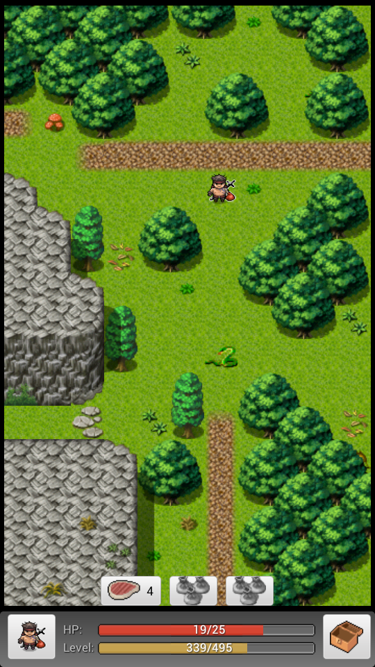

# GUI

## Graphical User Interface 

### Main Screen 

### The Chest

**Quickslots**

Long press the pouches inside to assign items for instant use

#### The Hero 

Brings up the game menu. Here you will have access to the following:

* Overview
* Quests
* Skills
* Inventory

“press” an item for information & “long press” for more options.

#### HP bar 

Displays your current/max HP status.

#### Level bar 

Displays you current/TNL status.

### Combat Icons 

Appears during Combat.

**Attack**

**End turn**

**Flee**

**Enemy**

