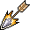

# Actor Conditions

## Mental Conditions

### Daze

BC: -40%\
Caused by: 20% chance of a hit from Gornaud (young, regular, or strong)\
Cure: none

### Chaotic Grip (x1)

BC: -10%\
DR: -1\
Caused by: hit from various Iqhan Chaos creatures in colored robes and Chaos Beast\
Inflicted by: Chaos Reaper\
Cure: none\
Note: the various Iqhan Chaos creatures, and the Chaos Reaper inflict Chaotic grip x5

### Intoxicated

AP: 1\
AC: -30%\
AD: 4\
Raises Max HP +15\
Caused by: drinking Blackwater Brew

### Minor Berserker Rage

AC: 60%\
BC: -90%\
DR: -1\
Raises Max HP +35\
Caused by: drinking Potion of blind rage, using Sword of Shadow's rage (50% chance with each kill)

### Minor Weapon Feebleness

AD: -3 \
Caused by: 20% chance from a hit from Allaceph (Young, Strong, Radiant, Ancient, or Tough), Vaeregh, Radiant guardian (boss monster), Toszylae (lich boss monster)\
Cure: none\
Note: inflicted by different multiples (x2, x3) and different numbers of rounds based on the monster

### Focused Damage

Constant effect\
Attack cost (AP): 1\
AD: 3\
Caused by: drinking a potion of damage focus, or strong potion of damage focus (gives Focused Damage x2)

### Focused Accuracy

Constant effect\
Attack cost (AP): 1\
AC: 40%\
Caused by: drinking a potion of accuracy focus, or strong potion of accuracy focus (gives Focused Accuracy x2)

## Blood Disorder Conditions

### Weak Poison

Drains 1 HP every round\
Caused by: hit from any venomous creature, drinking a weak poison\
Inflicted by: Blackwater poisoned dagger (50% chance)\
Cure: Weak poison antidote potion\
Note: this effect can be stacked if inflicted in separate attacks

### Bleeding Wound (x1)

Drains 1 HP every round\
Caused by: Strong Izthiel, Izthiel Guardian\
Inflicted by: Barbed dagger (50% chance)\
Cure: Ointment of bleeding wounds potion\
Note: effect can be inflicted in multiples, and stacked if inflicted in separate attacks

### Blackwater Misery

AP: 1\
AC: -50%\
CC: -50%\
Caused by: equipping any Blackwater item.\
Cure: Unequipping all Blackwater items.

### Insect Contagion (x1)

AC: -10%\
AD: -1\
Caused by: 70% chance from a hit from Plaguestrider (Tough, Wooly, Tough wooly, Nesting, Vile, Hardshell, Servant, Master), Plaguecrawler (regular, Black)\
Note: the effect can be inflicted in multiples

### Blistering Skin (x1)

Every round: Drains 1 HP\
Caused by: 50% chance from a hit from Plaguestrider (Wooly, Tough wooly, Nesting, Vile, Servant, Master),\
20% chance from Plaguecrawler (regular, Black), Plaguestrider (Hardshell, Tough)\
Note: the effect can be inflicted in multiples

### Irdegh Poison

Drains 1HP every round\
Caused by: on hit, 10% chance from Irdegh spawn, 50% chance from Piercing Irdegh or Venomous Irdegh\
Note: Irdegh poison effect can be stacked if inflicted in separate attacks

## Physical Capacity Conditions

### Minor Fatigue

Attack cost AP: 2\
AD: -1\
Move cost penalty +2 AP\
Caused by: hit from any Wyrm creature or trainer, using Shadowfang (20% chance on hit, inflicted on self)\
Cure: Restore fatigue potion

### Stunned

Attack cost AP: 5\
Lowers max AP by 2\
Move cost penalty +8 AP\
Caused by: on hit, 20% chance from Arulir, 10% chance from Tough Maonit brute\
Cure: none

### Minor Speed

Raises Max AP +2\
Caused by: drinking a minor potion of speed

### Kazaul Rotworms

Constant effect\
DR: -1\
Lowers max HP by 15\
Lowers max AP by 3\
Caused by: Toszylae (lich boss monster) infects you with it when you confront him after killing the Radiant Guardian\
Cure: After killing Toszylae, talk to Ulirfendor to progress the “I have it in me” quest, which will eventually lead to a cure.

## Spiritual

### **Blessings Note**

Blessing effects and rounds do not stack, so don't buy more than 1 of each at a time unless you like throwing away your gold.

### Shadow Regeneration

Restores 1 HP every round\
Caused by: equipping Ring of Lesser Shadow (RoLS)\
The effect does not stack if you equip two rings

### Bless

Constant effect\
AC: 5%\
Caused by: equipping Elytharan redeemer (ElyR)

### Blessing of Shadow Strength

Constant effect (30 rounds)\
AD: 1 Caused by: blessing can be purchased from Talion for 300 gold

### Blessing of Shadow Regeneration

Constant effect (45 rounds)\
Restores 1 HP every round\
Caused by: blessing can be purchased from Talion for 250 gold

### Blessing of Shadow Accuracy

Constant effect (30 rounds)\
AC: 30%\
Caused by: blessing can be purchased from Talion for 250 gold

### Shadow Guardian Blessing

Constant effect (20 rounds)\
DR: 1\
Raises max HP +30\
Caused by: blessing can be purchased from Talion for 400 gold

## General Notes

Drinking a potion has a 100% chance of causing the condition, and the resistance skills have no effect on that.\
All conditions (good or bad) are removed when resting in a bed (except for Blackwater Misery, Kazaul rotworms, Shadow Regeneration, and Bless).
