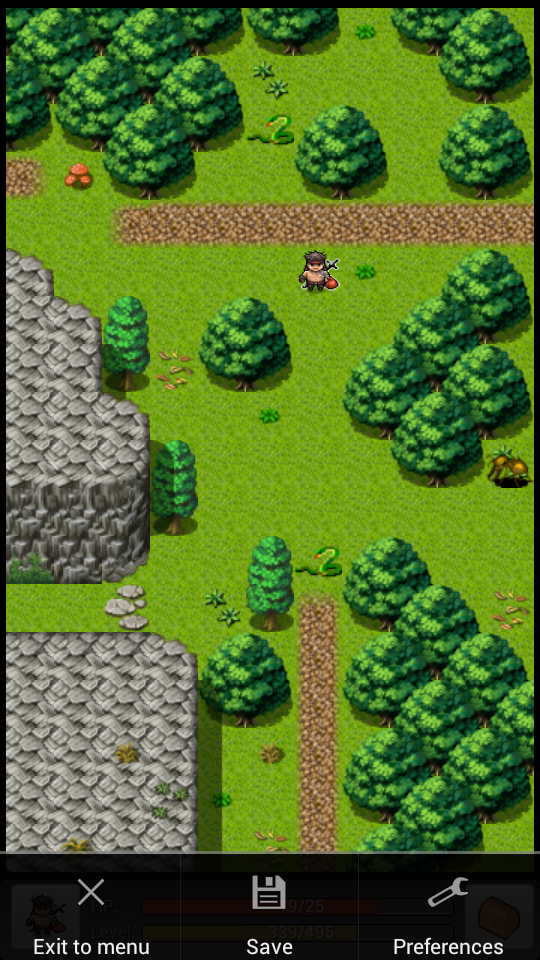

# Options

## Game Options

### Exit to menu 

Exit to the main menu.

### Save 

Create a new save slot or overwrite an existing one.

## Preferences

This screen covers a variety of settings that can be changed.

**Display**

**Fullscreen**

Displays the game in full-screen mode. (Requires restart)

**Scaling Factor**

Makes the game view display everything larger.

* Normal Size
* 1.5x Size
* Double Size

**Optimized Drawing**

Disable this if you see graphical artifacts. Enabling this option will make the game only redraw the changed parts of the screen every frame.\

## **Dialog Confirmation**

**Confirm Reset**

Gives a question about whether you want to rest when entering a bed. Otherwise, you will always automatically rest.

**Confirm Attack**

Enables the 'Do you want to attack..?' dialog box when attacking a monster.

**Display Monster Loot**

Choose how you want to show the results of a fight (gold, experience, items).

* Show the loot dialog box.
* Show short notification
* Do not display

## **Combat**

**Combat Speed**

Determines how fast monsters attack.

* Instant (no animations)
* Fast
* Normal
* Slow

## **Movement**

**Movement Method**

Type of movement method and handling of obstacles.

* Straight (original)
* Avoiding obstacles

**Virtual D-pad**

Enables a virtual on-screen directional pad to guide movement.

* Disabled
* lower right corner
* Lower left corner
* Center bottom
* Center left
* Center right
* Upper left corner
* Upper right corner
* Center top

**Minimizable D-pad**

If the virtual d-pad is enabled, this setting allows the d-pad to be minimized by pressing its center.
